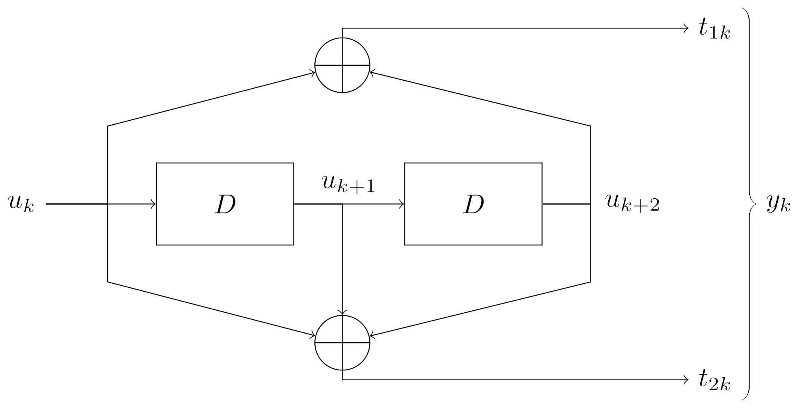

# Progetto di Reti Logiche | A.A. 2021-2022

Progetto realizzato da [Riccardo Motta](https://github.com/mrmotta) e [Matteo Negro](https://github.com/Matteo-Negro).

La documentazione completa è disponibile nella [Wiki](../../wiki).

## Specifica del progetto

La seguente specifica è tratta direttamente da quella fornita dai docenti del corso.

### Descrizione generale

Si implementi un modulo hardware (descritto in VHDL) che si interfacci con una memoria e che segua la seguente specifica.

Il modulo riceve in ingresso una sequenza continua di `W` parole, ognuna di 8 bit, e restituisce in uscita una sequenza continua di `Z` parole, ognuna da 8 bit. Ognuna delle parole di ingresso viene serializzata; in questo modo viene generato un flusso continuo `U` da 1 bit. Su questo flusso viene applicato il codice convoluzionale ½ (ogni bit viene codificato con 2 bit) secondo lo schema riportato in figura; questa operazione genera in uscita un flusso continuo `Y`. Il flusso `Y` è ottenuto come concatenamento alternato dei due bit di uscita. Utilizzando la notazione riportata in figura, il bit `u_k` genera i bit `p_1k` e `p_2k` che sono poi concatenati per generare un flusso continuo `y_k` (flusso da 1 bit). La sequenza d'uscita `Z` è la parallelizzazione, su 8 bit, del flusso continuo `y_k`.

La lunghezza del flusso `U` è `8 * W`, mentre la lunghezza del flusso `Y` è `8 * W * 2` (`Z = 2 * W`).

Il convolutore è una macchina sequenziale sincrona con un clock globale e un segnale di reset con il seguente diagramma degli stati che ha nel suo `00` lo stato iniziale, con uscite in ordine `P_1k`, `P_2k` (ogni transizione è annotata come `u_k / p_1k`, `p_2k`).

Un esempio di funzionamento è il seguente dove il primo bit a sinistra (il più significativo del byte) è il primo bit seriale da processare:

- Byte in ingresso: `10100010` (viene serializzata come `1` al tempo `t`, `0` al tempo `t + 1`, `1` al tempo `t + 2`, `0` al tempo `t + 3`, `0` al tempo `t + 4`, `0` al tempo `t + 5`, `1` al tempo `t + 6` e `0` al tempo `t + 7`)

Applicando l’algoritmo convoluzionale si ottiene la seguente serie di coppie di bit:

    T     0  1  2  3  4  5  6  7
    ----------------------------
    u_k   1  0  1  0  0  0  1  0
    p_1k  1  0  0  0  1  0  1  0
    p_2k  1  1  0  1  1  0  1  1

Il concatenamento dei valori `p_1k` e `p_2k` per produrre `Z` segue il seguente schema: `p_1k` al tempo `t`, `p_2k` al tempo `t`, `p_1k` al tempo `t + 1`, `p_2k` al tempo `t + 1`, `p_k1` al tempo `t + 2`, `p_2k` al tempo `t + 2`, ... cioè `Z`: `1101000111001101`.

- Byte in uscita: `11010001` e `11001101`

Nota: ogni byte di ingresso `W` ne genera due in uscita (`Z`).

### Dati

Il modulo da implementare deve leggere la sequenza da codificare da una memoria con indirizzamento al byte in cui è memorizzato; ogni singola parola di memoria è un byte. La sequenza di byte è trasformata nella sequenza di bit `U` da elaborare. La quantità di parole `W` da codificare è memorizzata nell'indirizzo `0`, il primo byte della sequenza `W` è memorizzato all'indirizzo `1`, mentre lo stream di uscita `Z` deve essere memorizzato a partire dall'indirizzo `1000` (mille). La dimensione massima della sequenza di ingresso è 255 byte.

### Note ulteriori sulla specifica

- Il modulo partirà nella elaborazione quando un segnale `START` in ingresso verrà portato a `1`. Il segnale di `START` rimarrà alto fino a che il segnale di `DONE` non verrà portato alto. Al termine della computazione (e una volta scritto il risultato in memoria), il modulo da progettare deve alzare (portare a `1`) il segnale `DONE` che notifica la fine dell'elaborazione. Il segnale `DONE` deve rimanere alto fino a che il segnale di `START` non è riportato a `0`. Un nuovo segnale `START` non può essere dato fin tanto che `DONE` non è stato riportato a zero. Se a questo punto viene rialzato il segnale di `START`, il modulo dovrà ripartire con la fase di codifica.

- Il modulo deve essere dunque progettato per poter codificare più flussi uno dopo l'altro. Ad ogni nuova elaborazione (quando `START` viene riportato alto a seguito del `DONE` basso), il convolutore viene portato nel suo stato di iniziale `00` (che è anche quello di reset). La quantità di parole da codificare sarà sempre memorizzata all'indirizzo `0` e l'uscita deve essere sempre memorizzata a partire dall'indirizzo `1000`.

- Il modulo deve essere progettato considerando che prima della prima codifica verrà sempre dato il `RESET` al modulo. Invece, come descritto nel protocollo precedente, una seconda elaborazione non dovrà attendere il reset del modulo ma solo la terminazione della elaborazione.

## Generatore di casi di test e risolutore

Lo [script](testcase.py) è scritto in Python3 e permette di generare dei casi di test con relative soluzioni o, data in input una sequenza di byte, di generare l'output corrispondente.

I parametri (opzionali) disponibili sono:

Comando    | Alias | Tipo  | Range di valori | Default | Descrizione
---------- | ----- | ----- | --------------- | ------- | -----------
`--bytes`  | `-b`  | `int` | `[0; 255]`      | `0`     | Numero di byte da generare per ciascun caso di test. Se vale `0`, per ogni caso di test viene generato un numero casuale di byte compreso nell'intervallo `[0; 255]`. Viene ignorato se si passa `--solve`.
`--cases`  | `-c`  | `int` | `>= 0`          | `0`     | Numero di casi di test da generare. Se vale `0`, viene generato un numero di casi di test compreso nell'intrevallo `[0; 1000]`. Viene ignorato se si passa `--solve`.
`--output` | `-o`  | `str` | String          | None    | File di output dove salvare i risultati. Di default stampa tutto a terminale.
`--solve`  | `-s`  | `srt` | String          | None    | Stringa di byte da processare. In questo caso vengono ignorati eventuali comandi `--bytes` e `--cases`.
## Licenza

Tutti i file sono disponibili secondo la [licenza MIT](LICENSE).
